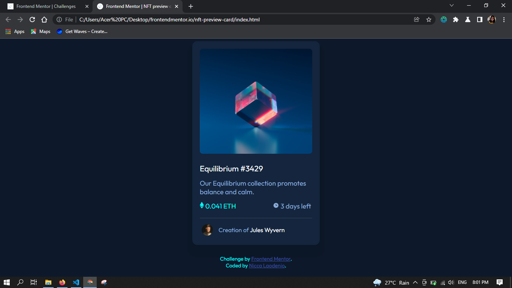
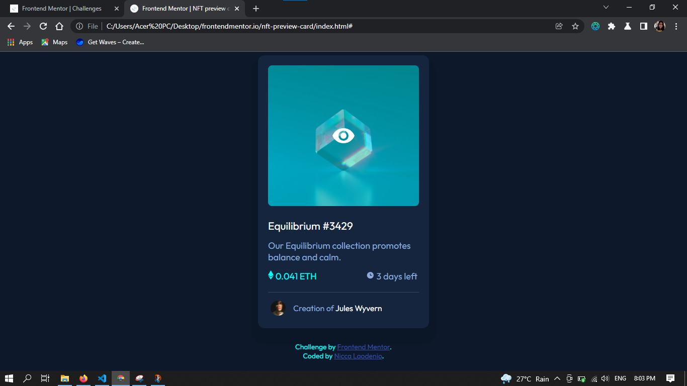
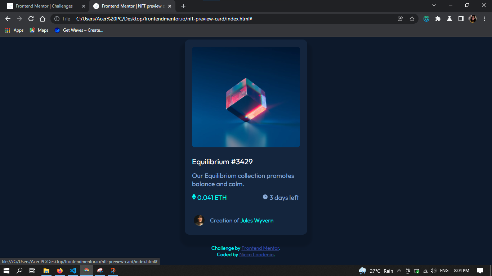

# this is the markdown (MD file) for this challenge
# Frontend Mentor - NFT preview card component solution

This is  my solution to the [NFT preview card component challenge on Frontend Mentor](https://www.frontendmentor.io/challenges/nft-preview-card-component-SbdUL_w0U). Frontend Mentor challenges help you improve your coding skills by building realistic projects. 

## Table of contents
  - [The challenge](#the-challenge)
  - [Screenshot](#screenshot)
  - [Links](#links)
- [My process](#my-process)
  - [Built with](#built-with)
  - [What I learned](#what-i-learned)
  - [Continued development](#continued-development)
  - [Useful resources](#useful-resources)
- [Author](#author)
- [Acknowledgments](#acknowledgments)


## Overview

### The challenge

Users should be able to:

- View the optimal layout depending on their device's screen size
- See hover states for interactive elements

### Screenshot





**Note: Delete this note and the paragraphs above when you add your screenshot. If you prefer not to add a screenshot, feel free to remove this entire section.**

### Links


## My process

### Built with

- Semantic HTML5 markup
- CSS properties
- Flexbox
- CSS Grid

### What I learned
      In this challenge i learn how to use grid as a container element, and I understand the importance of using multiple container for even just a single element. 

<!-- ```html
<h1>Some HTML code I'm proud of</h1>
```
```css
.proud-of-this-css {
  color: papayawhip;
}
```
```js
const proudOfThisFunc = () => {
  console.log('🎉')
}
``` -->
### Continued development
    css combinators are quite useful I think it could be better if I keep on using those then the pseudo elements. the different uses of flexbox and grid


### Useful resources
    useful resources are github, google, mdn, w3school and stackoverflow haha


## Author

- Website - [Nicca Laodenio](https://github.com/niccalaodenio)
- Frontend Mentor - [@yourusername](https://www.frontendmentor.io/profile/niccalaodenio)
- Twitter - [@yourusername](https://www.twitter.com/niccalaodenio)


## Acknowledgments
  Special thanks to Mr. D***** .. Di nakaka reply kay busy. well, busy lat ak hahah thank you saim kunta la tlaga dire ka bakla hahahajk
  stay kind plss 
